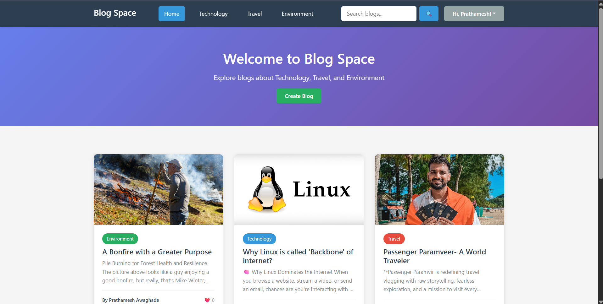
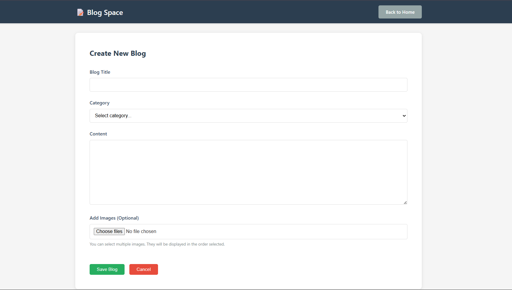
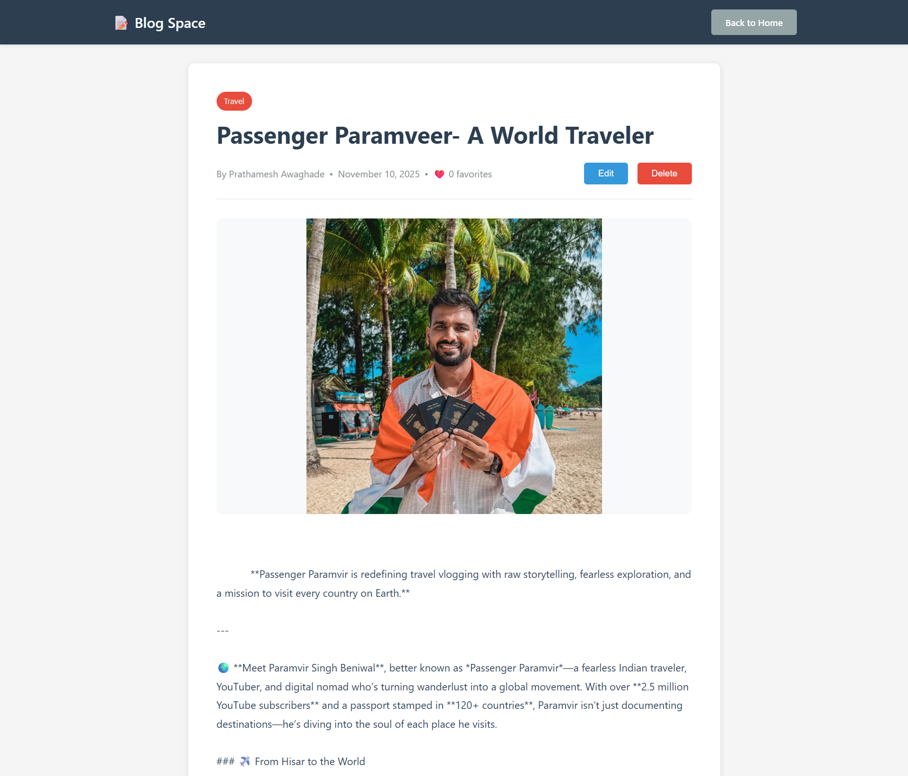

# 📝 Blog Space

> A full-stack blogging platform for Technology, Travel, and Environment enthusiasts


---

## 🌟 Overview

**Blog Space** is a modern, responsive blogging platform that enables users to create, read, and interact with blog posts across three main categories: **Technology**, **Travel**, and **Environment**. The platform supports two distinct user roles with tailored functionalities for each.

---

## ✨ Key Features

### For Everyone (Guest & Logged-in Users)
- **Browse & Search** - Explore blogs by category, title, or author
- **Responsive Design** - Seamless experience across all devices
- **Modern UI** - Clean, intuitive interface with smooth navigation

### For Creators (Bloggers)
- **Create & Edit Blogs** - Rich content editor with image support
- **Track Engagement** - View favorite counts on your posts
- **Manage Content** - Edit or delete your blogs anytime
- **Image Support** - Add multiple images to enhance your posts

### For Users (Readers)
- **Favorites System** - Save blogs to your personal collection
- **Personalized Library** - Access your favorited blogs easily
- **Discover Content** - Find blogs by category or search

---

## 🛠️ Tech Stack

### Backend
- **Runtime:** Node.js v18+
- **Framework:** Express.js v4.18+
- **Database:** MySQL v8.0+
- **Authentication:** JWT (JSON Web Tokens)
- **Security:** bcryptjs for password hashing

### Frontend
- **HTML5** - Semantic markup
- **CSS3** - Modern styling with Flexbox & Grid
- **Vanilla JavaScript** - ES6+ features
- **Responsive Design** - Mobile-first approach

### Additional Tools
- **dotenv** - Environment configuration
- **cookie-parser** - Cookie handling
- **mysql2** - MySQL driver with Promise support

---

## 🚀 Quick Start

### Prerequisites
- Node.js (v18 or higher)
- MySQL (v8.0 or higher)
- npm or yarn

### Installation

```bash
# 1. Clone the repository
git clone <repository-url>
cd blog-space

# 2. Install dependencies
npm install

# 3. Configure environment
cp .env.example .env
# Edit .env with your database credentials

# 4. Set up database
mysql -u root -p < database/schema.sql

# 5. Start the server
npm run dev
```

### Access the Application
Open your browser and navigate to: `http://localhost:3000`

---

## 📸 Screenshots

### Home Page


### Blog Creation


### Blog View


---

## 📚 Documentation

Comprehensive documentation is available in separate files:

- **[Functional Documentation](docs/readme/functional_docs.md)** - Features, user workflows, and use cases
- **[Technical Documentation](docs/readme/technical_docs.md)** - Architecture, API design, and implementation details
- **[Setup Guide](docs/readme/setup_guide.md)** - Detailed installation and configuration instructions

---

## 🗂️ Project Structure

```
blog-space/
├── config/
│   └── database.js          # Database configuration
├── middleware/
│   └── auth.js              # Authentication middleware
├── routes/
│   ├── auth.js              # Authentication routes
│   ├── blogs.js             # Blog CRUD routes
│   └── favorites.js         # Favorites routes
├── public/
│   ├── css/
│   │   └── style.css        # Main stylesheet
│   ├── js/
│   │   ├── main.js          # Home page logic
│   │   ├── auth.js          # Authentication logic
│   │   ├── blog-editor.js   # Blog creation/editing
│   │   └── blog-view.js     # Blog viewing logic
│   └── images/              # Static images
├── views/
│   ├── index.html           # Home page
│   ├── login.html           # Login page
│   ├── register.html        # Registration page
│   ├── create-blog.html     # Blog editor
│   └── blog-view.html       # Blog detail page
├── server.js                # Main server file
├── package.json             # Dependencies
└── .env                     # Environment variables
```

---

## 🔐 Default Test Accounts

For testing purposes, you can create accounts with these credentials:

**Creator Account:**
- Email: `creator@test.com`
- Password: `Test@123`
- Type: Creator (can write blogs)

**User Account:**
- Email: `user@test.com`
- Password: `Test@456`
- Type: User (can read and favorite blogs)

---

## 🌐 API Endpoints

### Authentication
- `POST /api/auth/register` - Register new user
- `POST /api/auth/login` - User login
- `POST /api/auth/logout` - User logout
- `GET /api/auth/check` - Check auth status

### Blogs
- `GET /api/blogs` - Get all blogs (with filters)
- `GET /api/blogs/:id` - Get single blog
- `POST /api/blogs` - Create blog (auth required)
- `PUT /api/blogs/:id` - Update blog (auth required)
- `DELETE /api/blogs/:id` - Delete blog (auth required)

### Favorites
- `GET /api/favorites` - Get user's favorites (auth required)
- `POST /api/favorites` - Add to favorites (auth required)
- `DELETE /api/favorites/:blogId` - Remove from favorites (auth required)
- `GET /api/favorites/check/:blogId` - Check if favorited (auth required)

---

## 🔒 Security Features

- Password hashing with bcrypt
- JWT-based authentication
- HTTP-only cookies
- SQL injection prevention (parameterized queries)
- XSS protection (input sanitization)
- Strong password requirements
- Session management

---

## 🚧 Future Enhancements

- User profile pages
- Comments system
- Blog tags and advanced filtering
- Social media sharing
- Email notifications
- Rich text editor (WYSIWYG)
- File system or cloud storage for images
- Pagination for blog lists
- User analytics dashboard
- Dark mode

---

## 🐛 Known Issues & Limitations

- Images stored as Base64 in database (for simplicity)
- No pagination (all blogs loaded at once)
- No email verification
- No password reset functionality
- Limited image size (5MB per image)

---

## 📝 License

This project is licensed under the MIT License - see the [LICENSE](LICENSE) file for details.

---

## 👤 Author

**Your Name**
- GitHub: [@Prathamesh-2448](https://github.com/Prathamesh-2448)
- Email: awaghadep24@gmail.com

---

## 🙏 Acknowledgments

- Built as part of an interview assessment
- Icons from emoji set
- Inspired by modern blogging platforms

---

## 📞 Support

For questions or issues:
1. Check the [Setup Guide](SETUP_GUIDE.md)
2. Review the [Technical Documentation](TECHNICAL_DOCUMENTATION.md)
3. Open an issue on GitHub
4. Contact the author

---

**⭐ If you find this project useful, please consider giving it a star!**
